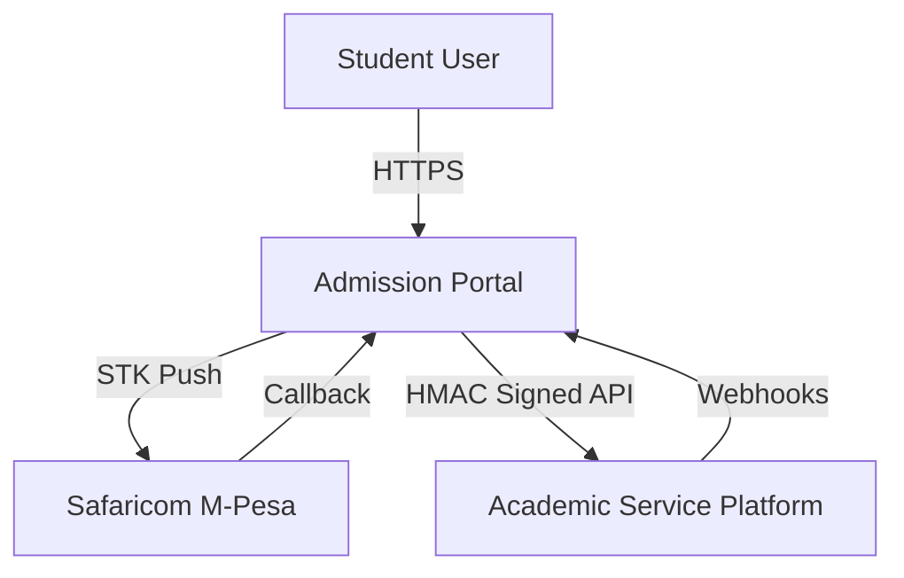

# Integration Architecture

## Overview
The Student Admission Portal operates in a distributed environment, acting as a gateway between students, payment providers, and the internal university system (ASP).

## Integration Map

## External Systems

### 1. Safaricom M-Pesa (Payments)
- **Type:** Payment Gateway
- **Method:** REST API (STK Push)
- **Flow:**
  1. Student initiates payment on Portal.
  2. Portal requests STK Push from M-Pesa.
  3. M-Pesa prompts user on phone.
  4. User enters PIN.
  5. M-Pesa sends asynchronous **Callback** to Portal.
- **Security:** OAuth 2.0 (Access Token generation).

### 2. Academic Service Platform (ASP)
- **Type:** Internal ERP/SIS
- **Method:** REST API
- **Authentication:** HMAC-SHA256 Signature (`X-Signature`, `X-Timestamp`, `X-API-Key`).
- **Data Flow:**
  - **Outbound (Portal -> ASP):** Get Grades, Timetable, Fees.
  - **Inbound (ASP -> Portal):** Webhooks for Status Change, Grade Updates.

## Data Consistency
- **Caching:** The Portal caches ASP data (grades, fees) for performance (Redis/File cache).
- **Webhooks:** Real-time updates from ASP trigger local database updates to keep status in sync.
