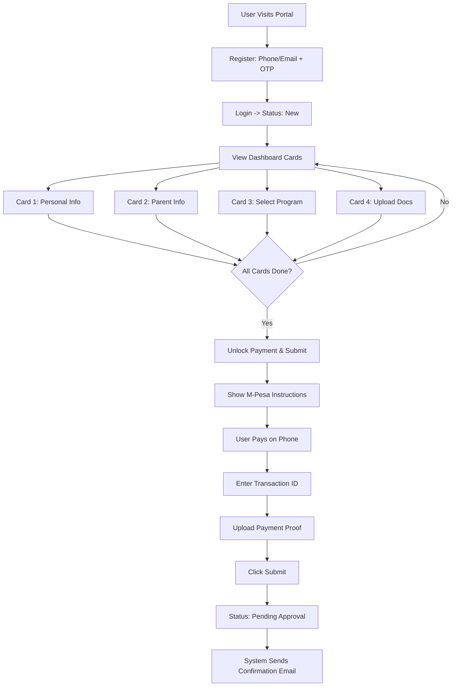
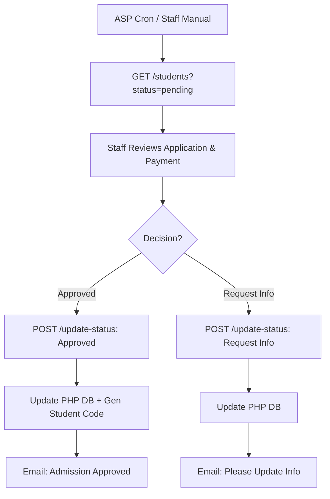
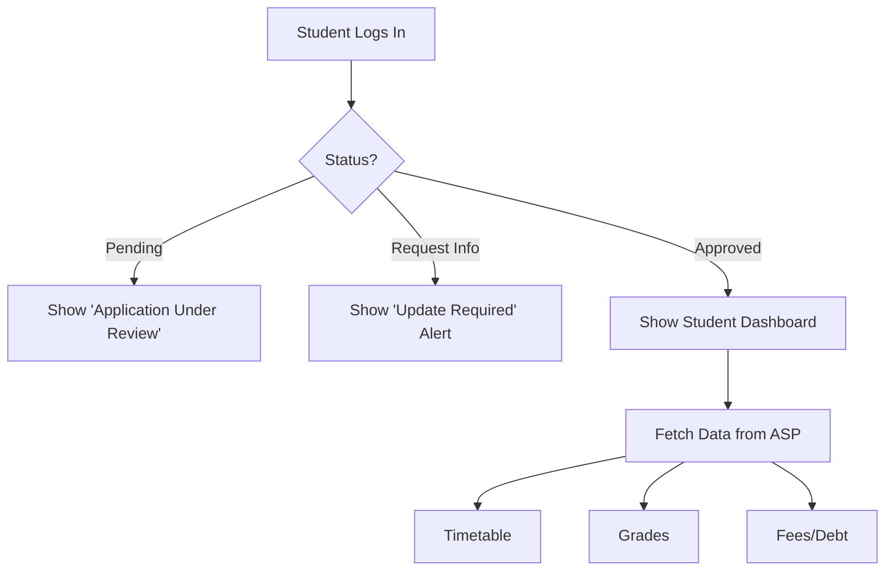

---
stepsCompleted:
  - step-01-init
  - step-02-discovery
  - step-03-core-experience
  - step-04-emotional-response
  - step-05-inspiration
  - step-06-design-system
  - step-07-defining-experience
  - step-08-visual-foundation
  - step-09-design-directions
  - step-10-user-journeys
  - step-11-component-strategy
  - step-12-ux-patterns
  - step-13-responsive-accessibility
  - step-14-complete
inputDocuments:
  - _bmad-output/planning-artifacts/prd.md
  - _bmad-output/planning-artifacts/prd-validation-report.md
  - _bmad-output/project-overview.md
  - _bmad-output/ui-component-inventory-student-admission-portal.md
  - _bmad-output/architecture-student-admission-portal.md
  - _bmad-output/development-guide-student-admission-portal.md
  - _bmad-output/data-models-student-admission-portal.md
  - _bmad-output/api-contracts-student-admission-portal.md
  - _bmad-output/integration-architecture.md
  - _bmad-output/source-tree-analysis.md
  - _bmad-output/index.md
lastStep: 14
---

# UX Design Specification blood-group-student-port

**Author:** Wavister
**Date:** 2026-01-20

---

<!-- UX design content will be appended sequentially through collaborative workflow steps -->

## Executive Summary

### Project Vision

The Student Admission Portal is a critical digital transformation tool replacing manual admissions. It focuses on speed (under 15 min application), reliability (M-Pesa integration), and transparency (real-time status updates). It's a Laravel-based web application acting as a gateway to the internal Academic Service Platform (ASP).

### Target Users

*   **Applicants (e.g., Minh):** High school graduates. They are tech-savvy but anxious about deadlines. They primarily use mobile devices and need immediate reassurance (confirmations, status updates).
*   **Admissions Staff (e.g., Ms. Lan):** While they primarily use the internal ASP, the Portal must provide them with clean, validated data and synced statuses to ensure their workflow is efficient.

### Key Design Challenges

1.  **High-Stakes Anxiety:** Users need constant feedback and reassurance (e.g., clear "Application Received" states, visual progress indicators) to mitigate anxiety about lost applications.
2.  **Mobile Data Entry:** Filling complex multi-part forms and uploading documents on mobile devices can be cumbersome. We need optimized input types and easy file picking/previewing.
3.  **Payment Failure Handling:** M-Pesa STK pushes can fail or time out. The UI needs clear, non-alarming retry mechanisms and fallback instructions.

### Design Opportunities

1.  **Micro-Interactions for Reassurance:** Use positive reinforcement (ticks, success animations) after each completed step to build confidence.
2.  **Smart Defaults & Validation:** Pre-fill known data and validate fields in real-time to prevent submission errors before they happen.

## Core User Experience

### Defining Experience

The core user experience centers on the **Application Submission Loop**: a linear, 4-step process (Personal Info -> Parent Info -> Document Upload -> Payment & Submit). This flow is the critical path; if users can complete this effortlessly and receive immediate confirmation, the product succeeds. The experience is designed to minimize anxiety through constant feedback and clear progress indication.

### Platform Strategy

*   **Primary Platform:** Mobile Web (Responsive). The interface must be optimized for touch targets, vertical scrolling, and on-screen keyboards.
*   **Secondary Platform:** Desktop Web. A fully responsive layout that adapts gracefully to larger screens (e.g., for use in cyber cafes or by staff).
*   **Constraints:** Must work reliably on 4G networks and support standard mobile browsers (Chrome, Safari, etc.).

### Effortless Interactions

*   **Document Upload:** Users should be able to snap a photo or pick a file with a single tap. The system should handle compression/validation automatically and provide an instant preview.
*   **Payment Entry:** M-Pesa integration should be reduced to "Enter Phone Number" and "Check Phone for PIN". No complex manual entry of account numbers.

### Critical Success Moments

1.  **The "Success" Modal:** The immediate visual confirmation after payment/submission is the "Relief Moment" that signals completion and reduces anxiety.
2.  **Approval Notification:** The email/SMS notification that says "Approved" completes the journey and validates the user's effort.

### Experience Principles

1.  **Mobile-First, Always:** Every design decision prioritizes small screens, touch interaction, and readability on mobile devices.
2.  **Guide, Don't Scold:** Validation should be proactive and helpful (e.g., "Please enter a valid phone number" as they type) rather than reactive error messages after submission.
3.  **Transparency:** The system must always communicate its state (e.g., "Syncing...", "Payment Pending", "Application Received") to build trust.

## Desired Emotional Response

### Primary Emotional Goals

The overarching emotional goal is **Relief** mixed with **Confidence**. Users should feel "I did it, it worked, and I know exactly where I stand." The absence of anxiety is the primary measure of success.

### Emotional Journey Mapping

1.  **Discovery (Landing Page):** *Hopeful but Cautious*. The user wonders, "Can I really do this online? Will it work?"
2.  **Action (Application Form):** *Supported and Capable*. As they progress through easy steps, they feel, "This is easier than I thought. I can do this."
3.  **Completion (Payment/Success):** *Relieved and Proud*. The moment of submission brings a release of tension. "I'm officially an applicant!"
4.  **Wait Phase:** *Reassured*. Even while waiting for approval, the user feels connected and informed, not forgotten.

### Micro-Emotions

*   **Trust:** Triggered when the M-Pesa prompt appears instantly on their phone.
*   **Anxiety Mitigation:** Triggered when they see the "Saved as Draft" indicator or auto-save notifications.
*   **Delight:** Triggered by small interactions, like a clear preview tick when a document uploads successfully.

### Design Implications

*   **For Trust:** Prominently display official logos (University Shield, M-Pesa) and use security indicators (SSL padlocks, "Secure Payment" badges).
*   **For Relief:** Use unambiguous, high-impact Success states. A large green tick or a confetti animation is better than a small text notification.
*   **For Capability:** Chunk the form into small, digestible steps. A progress bar shows them how far they've come, making the task feel manageable.

### Emotional Design Principles

1.  **Celebrate Success:** Visually reward the user for completing the difficult task of applying.
2.  **Be the Calm Guide:** In moments of potential stress (payment, errors), the UI should be calm, clear, and directive, not alarming.
3.  **Never Leave Them Guessing:** Always confirm actions. Never let the user wonder "Did that work?".

## UX Pattern Analysis & Inspiration

### Inspiring Products Analysis

*   **M-Pesa App:** Chosen for its gold-standard handling of financial transactions in the region. It builds trust through clear, receipt-style confirmations and unambiguous status updates (Success vs. Failed).
*   **Typeform / Google Forms:** Chosen for their conversational data entry. They prove that breaking long forms into single questions or small groups reduces cognitive load and makes the process feel faster.
*   **WhatsApp:** Chosen for its resilience. It handles poor network conditions gracefully (optimistic UI, message status ticks), which is critical for our mobile-first user base.

### Transferable UX Patterns

1.  **Progressive Disclosure (Typeform-style):** Break the application form into distinct, labeled sections (Personal, Academic, Docs, Payment). Don't show everything at once.
2.  **Optimistic UI (WhatsApp-style):** When a user uploads a document, show it as "Uploading" immediately with a progress spinner, rather than freezing the UI.
3.  **Digital Receipt (Fintech-style):** The final success screen should be designed as a "receipt" that summarizes the application details and payment reference—something the user can screenshot for their records.

### Anti-Patterns to Avoid

1.  **The "Wall of Text":** Avoid long instructions or legal disclaimers upfront. Use "tl;dr" summaries or progressive disclosure for help text.
2.  **Mystery Meat Navigation:** Avoid icon-only buttons for critical actions. Always use text labels (e.g., "Upload Transcript", not just an upload icon).
3.  **Dead Ends:** Avoid generic error messages like "Submission Failed". Always explain *why* and provide a specific action (e.g., "Payment timed out. Tap here to retry.").

### Design Inspiration Strategy

*   **Adopt:** The "Digital Receipt" pattern for the post-submission success screen to provide tangible proof of application.
*   **Adapt:** The step-by-step wizard pattern. Instead of one-question-per-screen (too slow for this data density), use logical *groups* (e.g., "Personal Details" screen, "Parent Details" screen).
*   **Avoid:** Enterprise-style dashboards with complex sidebars and dense tables. Keep the student view linear and focused on the current status.

## Design System Foundation

### 1.1 Design System Choice

**Custom Themeable System based on TailwindCSS.**

### Rationale for Selection

1.  **Tech Stack Alignment:** Native fit for the existing Laravel 11 + TailwindCSS architecture.
2.  **Performance:** Generates minimal CSS, critical for mobile users on varied network speeds.
3.  **Development Speed:** Allows rapid construction using utility classes without fighting opinionated framework overrides.
4.  **Consistency:** Use of Tailwind's configuration (colors, spacing, typography) ensures systematic consistency across the app.

### Implementation Approach

*   **Framework:** TailwindCSS v4.
*   **Component Strategy:** Atomic Blade Components (e.g., `<x-input>`, `<x-card>`) wrapping Tailwind classes.
*   **Iconography:** Heroicons (Solid for active states, Outline for inactive).
*   **Typography:** 'Instrument Sans' for a clean, modern, and highly legible interface.

### Customization Strategy

*   **Colors:** Define a semantic palette in `tailwind.config.js` (e.g., `brand-primary`, `status-success`, `surface-card`).
*   **Spacing:** Stick to default Tailwind spacing scale for consistent rhythm.
*   **Radius:** Standardize border radius (e.g., `rounded-lg`) for all cards and inputs to maintain a soft, friendly aesthetic.

## 2. Core User Experience

### 2.1 Defining Experience

The defining experience is the **"One-Sitting Application"**: enabling a student to complete the entire admission process—from registration to payment—on a mobile device in under 15 minutes, without leaving the flow to find external resources. This transforms a multi-day ordeal into a single, seamless session.

### 2.2 User Mental Model

*   **Current Mental Model:** "Admissions are bureaucratic, paper-heavy, and require physical visits to banks/cyber cafes."
*   **Desired Mental Model:** "It's as easy as buying something online. I enter my details, snap a pic, pay with M-Pesa, and get a receipt."
*   **Shift:** Moving from "Administrative Burden" to "Digital Commerce" ease.

### 2.3 Success Criteria

1.  **Zero-Dropoff:** The user never hits a "blocking" state (e.g., unsure what to upload, payment fails without recourse).
2.  **Instant Feedback:** Every action (save, upload, pay) has an immediate visual response (spinner, tick, toast).
3.  **Tangible Proof:** The user leaves the session with a digital "receipt" that makes them feel secure.

### 2.4 Novel UX Patterns

*   **Integrated Payment Flow:** Unlike traditional systems that ask for a bank slip upload, this system integrates M-Pesa STK Push directly into the wizard. This removes the friction of "leaving the app to pay."
*   **Camera-First Uploads:** The document upload step triggers the camera directly on mobile, treating the phone as a scanner.

### 2.5 Experience Mechanics

1.  **Initiation:** "Apply Now" CTA -> OTP Login (No password fatigue).
2.  **Interaction (The Wizard):**
    *   **Step 1:** Personal Info (Auto-format dates/phones).
    *   **Step 2:** Docs (Tap to Snap -> Auto-compress -> Preview).
    *   **Step 3:** Review (Summary Card).
    *   **Step 4:** Payment (Tap "Pay" -> Phone prompts for PIN -> App auto-detects success).
3.  **Completion:** "Success" Modal with Confetti -> Redirect to Dashboard with "Application Received" status card.

## Visual Design Foundation

### Color System

To foster "Relief" and "Confidence" while maintaining institutional credibility:

*   **Primary Brand:** **Royal Blue** (`blue-700` in Tailwind). Represents trust, academic authority, and stability.
*   **Primary Action (CTA):** **Vibrant Blue** (`blue-600`). High contrast for "Next" and "Submit" buttons.
*   **Success Status:** **Mint Green** (`emerald-500`). For M-Pesa success receipts and "Application Received" badges. Calming and positive.
*   **Warning/Attention:** **Amber** (`amber-500`). For "Draft" status or "Action Required".
*   **Error:** **Rose Red** (`rose-500`). For validation errors (used sparingly).
*   **Surface:** **Off-White/Gray-50** backgrounds to reduce glare on mobile screens compared to stark white.

### Typography System

*   **Typeface:** **'Instrument Sans'** (Google Font).
    *   *Why?* It's highly legible on screens, has a modern geometric feel but retains humanistic warmth. Excellent character distinction for reading numbers (IDs, Phones).
*   **Hierarchy:**
    *   **Headings (H1/H2):** Bold, tight tracking. For page titles ("Your Application") and Section headers ("Personal Details").
    *   **Body:** Regular weight, generous line-height (1.6) for readability.
    *   **Labels:** Medium weight, slightly smaller, uppercase tracking for form labels (e.g., "DATE OF BIRTH").
    *   **Data:** Monospace (e.g., 'JetBrains Mono' or Tailwind `font-mono`) for critical numbers like Transaction IDs and Student Codes.

### Spacing & Layout Foundation

*   **Base Unit:** 4px (Tailwind standard).
*   **Mobile Layout:** Single column.
    *   **Padding:** `p-4` (16px) standard container padding.
    *   **Vertical Rhythm:** `gap-6` (24px) between major form sections to prevent cramping.
    *   **Touch Targets:** Minimum 44px height (`h-11`) for all inputs and buttons.
*   **Desktop Layout:** Centered card layout.
    *   Maximum width `max-w-2xl` for the form container to maintain readable line lengths.

### Accessibility Considerations

*   **Contrast:** All text must pass WCAG AA (4.5:1 ratio). `blue-600` on white passes comfortably.
*   **Focus States:** Custom focus rings (`ring-2 ring-blue-500 ring-offset-2`) for keyboard navigation (crucial for accessibility compliance).
*   **Semantic HTML:** Strict use of `<label>`, `<fieldset>`, and `aria-describedby` for form error messages.

## Design Direction Decision

### Design Directions Explored

We explored three primary directions:
1.  **The Clean Wizard:** Linear, focused, standard multi-step form.
2.  **The Conversational:** Large type, one question at a time.
3.  **The App Dashboard:** Card-based, overview-first, allowing non-linear navigation.

### Chosen Direction

**Direction 3: The App Dashboard (Card-Based)**

### Design Rationale

*   **Overview Effect:** Users can see the "whole picture" of what is required (4 cards: Personal, Parents, Docs, Pay) instantly, reducing fear of the unknown.
*   **Flexibility:** It allows users to fill sections in any order (e.g., if they don't have their parent's ID right now, they can skip to uploading their own photo).
*   **Status Clarity:** Each card acts as a status indicator (Empty -> In Progress -> Complete), giving a constant sense of progress.
*   **Modern Feel:** It feels like a native "App" rather than a long, boring web form.

### Implementation Approach

*   **Dashboard View:** A main "Home" screen displaying the 4 key cards.
*   **Detail Views:** Tapping a card opens that specific form section (e.g., in a modal or separate page).
*   **Progress Tracking:** A global progress bar at the top (`2/4 Completed`) updates as cards are marked "Done".

## User Journey Flows

### Journey 1: Registration & Application (The Primary Loop)

This journey defines how a new student enters the system and completes their application.

**Mechanics:**
1.  **Register:** User inputs Email/Phone -> System sends OTP -> User verifies & creates password -> Account "New".
2.  **Application:** User completes 4 cards on Dashboard:
    *   *Personal Info*
    *   *Parent Info*
    *   *Program Selection*
    *   *Documents* (Upload Grade 9/10 certs, Health cert)
3.  **Payment & Submission:**
    *   System displays Paybill/Till Number.
    *   User pays via M-Pesa.
    *   User enters **Transaction ID**.
    *   User uploads **Payment Proof** (screenshot/photo).
    *   User clicks **Submit**.
    *   *Status:* "Pending Approval". Email confirmation sent.

### Journey 2: Review & Synchronization (Staff View)

This journey defines how the internal staff processes the application.

**Mechanics:**
1.  **Sync:** ASP (Internal System) polls PHP Portal (`GET /students?status=pending`).
2.  **Review:** Staff reviews details and payment proof in ASP.
3.  **Decision:**
    *   *Approve:* ASP updates PHP Portal (`POST /update-status` -> Approved). Student gets Student Code.
    *   *Reject/Request Info:* ASP updates PHP Portal (`POST /update-status` -> Request Info). Student notified to fix.

### Journey 3: Post-Admission (Student View)

This journey defines what happens after the student is approved.

**Mechanics:**
1.  **Activation:** Status becomes "Approved".
2.  **Dashboard Shift:** The "Application Cards" disappear or minimize.
3.  **New View:** Dashboard now shows real-time data fetched from ASP:
    *   Timetable
    *   Grades
    *   Fees / Debt

### Journey Patterns

*   **Card-Based Navigation:** Use distinct cards for major sections (Personal, Parents, Docs) to allow flexible completion order.
*   **Manual Payment Fallback:** While STK Push is ideal, the flow *must* support manual Transaction ID entry and Proof Upload as the primary reliable method per `origin.md`.
*   **State-Driven Dashboard:** The dashboard view changes entirely based on the user's `status` (New vs. Pending vs. Approved).

### Flow Optimization Principles

1.  **Non-Blocking Payment:** Allow users to save the application draft *without* paying. Only block the final "Submit" button until payment proof is attached.
2.  **Proactive Validation:** Validate the M-Pesa transaction code format (e.g., 10 chars, uppercase) on the client side before submission to reduce server errors.
3.  **Clear Status Indicators:** Use color-coded badges (Yellow for Pending, Green for Approved, Red for Request Info) so the student knows their standing instantly upon login.

## Component Strategy

### Design System Components

Leveraging **TailwindCSS** + **Blade Components**, we will use standard HTML elements styled with utility classes.
*   **Buttons:** Standard, Outline, Ghost.
*   **Inputs:** Text, Select, Checkbox.
*   **Layout:** Card containers (`bg-white rounded-xl shadow-sm`).
*   **Alerts:** Info boxes for status messages.

### Custom Components

### `ImageUploader`

**Purpose:** Simplifying the multi-document upload process (ID, Certificates).
**Usage:** Used in the "Documents" card.
**Anatomy:** A dashed dropzone that turns into a preview card upon selection.
**States:**
*   *Empty:* "Tap to upload".
*   *Selected:* Shows thumbnail preview + file name.
*   *Error:* Red border if file is too large (>5MB).
**Interaction:** Clicking triggers file picker/camera. X button removes file.

### `StatusBadge`

**Purpose:** Communicating application status at a glance.
**Usage:** Dashboard header and list views.
**Variants:**
*   `New`: Gray/Blue.
*   `Pending`: Yellow/Amber.
*   `Approved`: Green.
*   `Request Info`: Red/Orange.
**Content Guidelines:** Short, uppercase label (e.g., "PENDING APPROVAL").

### `MpesaReceipt`

**Purpose:** Visualizing the payment confirmation to give users a sense of security.
**Usage:** Success modal and "Payment" card after submission.
**Anatomy:** A card styled like a paper receipt with jagged edges (CSS mask) containing transaction details.

### Component Implementation Strategy

*   **Atomic Design:** Build small atoms (Badge, Button) -> Molecules (InputGroup, UploadField) -> Organisms (ApplicationCard).
*   **Blade Components:** Encapsulate logic in `app/View/Components` (e.g., `<x-status-badge :status="$status" />`).
*   **Tailwind Config:** Define brand colors in `tailwind.config.js` to ensure `bg-brand-primary` works everywhere.

### Implementation Roadmap

**Phase 1 (MVP - Core Flow):**
*   `x-card`: The main container for dashboard items.
*   `x-input` / `x-select`: Standard form fields with error handling.
*   `x-image-uploader`: Essential for document submission.
*   `x-button`: Primary actions.

**Phase 2 (Feedback & Status):**
*   `x-status-badge`: For dashboard state.
*   `x-alert`: For "Request Info" feedback.
*   `x-mpesa-receipt`: For payment history.

## UX Consistency Patterns

### Button Hierarchy

*   **Primary (Action):** Solid Blue (`bg-blue-600`). Use for "Next", "Submit", "Pay". Only one per screen/view.
*   **Secondary (Safe):** Outline or Ghost (`border-gray-300` or `text-blue-600`). Use for "Save Draft", "Back", "Upload New Photo".
*   **Destructive:** Red Text/Icon (`text-red-600`). Use for "Remove File", "Cancel".
*   *Rule:* On mobile, the Primary button is always full-width at the bottom of the card or sticky footer.

### Feedback Patterns

*   **Toast (Ephemeral):** Top-center popover. Use for non-blocking info ("Draft Saved", "Copy Successful").
*   **Inline Alert (Blocking):** Colored box inside the form. Use for validation errors ("Invalid ID Number") or status updates ("Payment Failed - Check Phone").
*   **Modal (Interrupt):** Center overlay. Use ONLY for critical success (Payment Complete) or confirmation (Are you sure you want to cancel?).

### Form Patterns

*   **Labels:** Top-aligned, bold text.
*   **Validation:** Real-time (on blur).
    *   *Error:* Red border + Red text message below input.
    *   *Success:* Green checkmark icon inside right edge of input.
*   **Required Fields:** All fields are assumed required unless marked "(Optional)".

### Navigation Patterns

*   **Dashboard Root:** The centralized hub where all cards live.
*   **Drill-Down:** Clicking a card enters a "Detail View" (Modal or Sub-page).
*   **Back Navigation:** Detail views always have a prominent "Back to Dashboard" button.
*   **Progress Indication:** The Dashboard shows "Step X of 4" to orient the user globally.

### Additional Patterns

*   **Loading States:**
    *   *Skeleton Screens:* Use for the Dashboard when fetching status.
    *   *Button Spinner:* When submitting a form, the button text is replaced by a spinner, and the button becomes disabled.

## Responsive Design & Accessibility

### Responsive Strategy

*   **Mobile-First Approach:** All layouts are designed for 320px width first.
*   **Single Column:** The dashboard and forms are strictly single-column on mobile to avoid horizontal scrolling.
*   **Desktop Adaptation:**
    *   Container is constrained to `max-w-2xl` (approx 672px) to prevent lines becoming too long to read comfortably.
    *   The Dashboard grid expands to 2 columns on Tablet+ screens.

### Breakpoint Strategy

*   `sm`: 640px (Mobile Landscape)
*   `md`: 768px (Tablet)
*   `lg`: 1024px (Desktop)
*   `xl`: 1280px (Large Desktop)

### Accessibility Strategy

*   **WCAG 2.1 AA Compliance:** Mandatory.
*   **Keyboard Navigation:** All interactive elements (Inputs, Buttons, Cards) must be reachable via `Tab` key.
*   **Focus Management:** Custom focus rings (`ring-2 ring-blue-500`) ensure keyboard users know where they are.
*   **Screen Readers:**
    *   Images (Uploaded Docs) have dynamic `alt` text.
    *   Icons use `aria-hidden="true"`.
    *   Status Badges use `aria-label` to announce status clearly (e.g., "Status: Approved").

### Testing Strategy

*   **Real Device Testing:** Testing on low-end Android devices to ensure animations and transitions are smooth.
*   **Lighthouse:** Automated audits for Accessibility and Performance (Target 90+).
*   **Network Throttling:** Testing the "Optimistic UI" upload states on simulated 3G networks.

### Implementation Guidelines

*   **Units:** Use `rem` for font-size and spacing to respect user OS preferences.
*   **Touch Targets:** Ensure all clickable elements have `min-height: 44px` and `min-width: 44px`.
*   **No Auto-Play:** Avoid auto-playing videos or animations that could trigger motion sensitivity.
